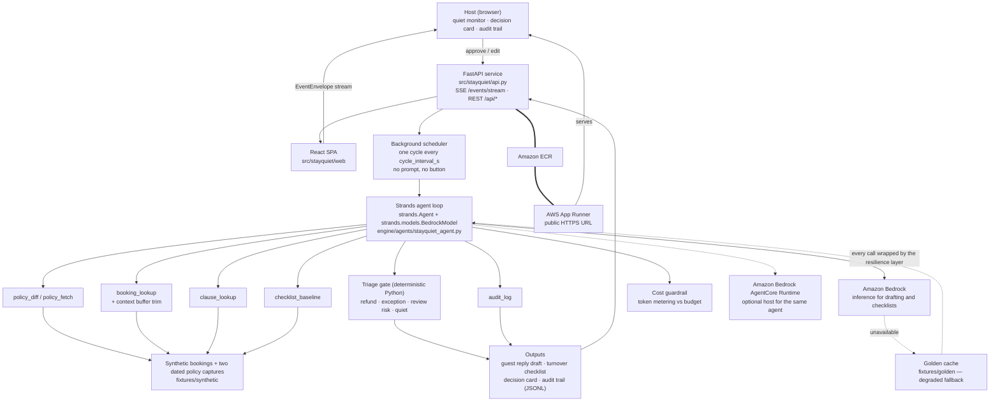

# StayQuiet — architecture

Every box is labelled with what it is and where it lives in this repository. The dashed edges are
fallback paths, not the happy path.

## The path a single booking takes

1. The **background scheduler** in `src/stayquiet/api.py` starts a cycle. No request and no prompt
   are involved; this is the product's central claim.
2. `engine/agents/stayquiet_agent.py` calls the **policy tools** to load the newest capture of the
   platform's public policy text and diff it, clause by clause, against the previous capture.
   Deterministic Python, no model.
3. Bookings whose clauses actually changed — or that have an open guest question or cleaner dispute
   — are selected. The rest are counted and skipped.
4. For each selected booking the **Strands agent loop**, running on an **Amazon Bedrock** model,
   chooses its own tools: it reads the booking and its recent messages (`booking_lookup`, which
   trims a long thread to a token budget), reads the *current* clause text (`clause_lookup`), and
   writes the guest reply. A second turn calls `checklist_baseline` and writes the turnover
   checklist. Every model call is wrapped by the resilience layer and metered by the cost
   guardrail.
5. The **triage gate** — deterministic Python — decides whether the host is interrupted: a
   cancellation in flight, a money clause behind the ask, or a listing with a dispute history
   becomes a decision card. Everything else is filed quietly.
6. Every step emits a typed **EventEnvelope** which the browser receives over SSE, so the host (and
   a judge) watches the loop work step by step.
7. `audit_log` writes an append-only trail; the host's approve or edit is written to it too.

## AWS services

| Service | Used for | Where |
|---|---|---|
| Amazon Bedrock | model inference behind the Strands agent loop | `src/stayquiet/model.py` |
| Amazon ECR | container image registry | `scripts/deploy-apprunner.sh` |
| AWS App Runner | the public HTTPS URL | `scripts/deploy-apprunner.sh` |
| Amazon Bedrock AgentCore Runtime | optional additional host for the same agent | `deploy/agentcore/` |

## Exporting a PNG for the submission form

The Markdown block above renders on GitHub, which satisfies the "diagram in the repository"
requirement. For a form that wants an image file, paste `docs/architecture.mmd` into
<https://mermaid.live>, export PNG, and save it as `docs/architecture.png`.
